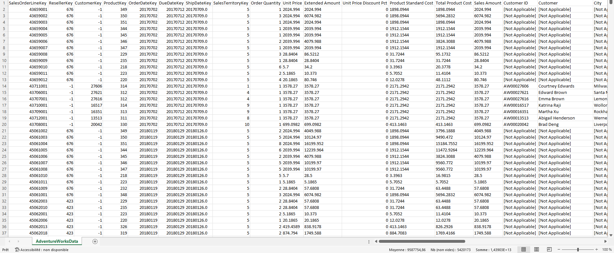
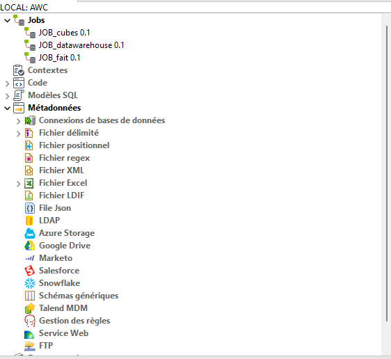
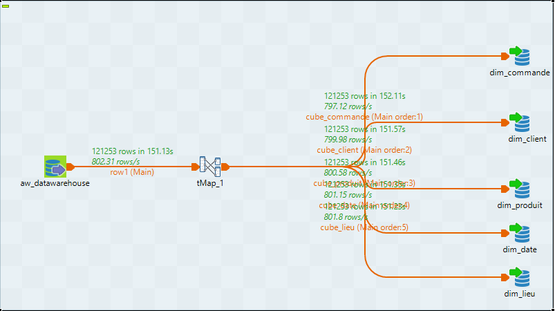
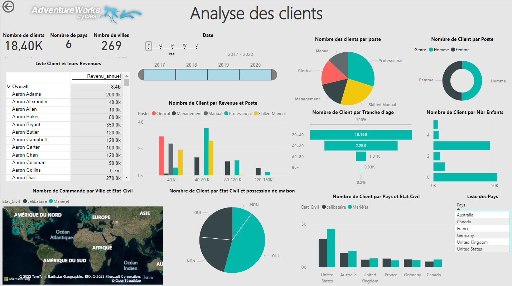
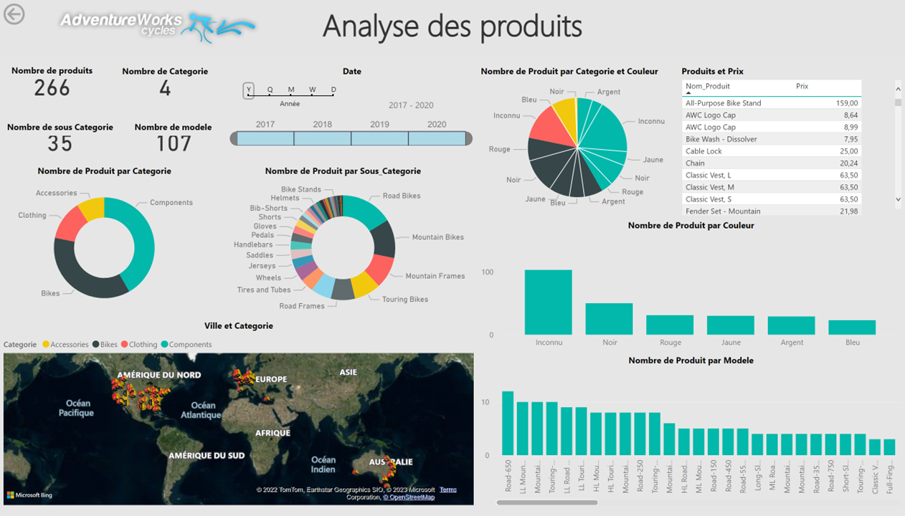
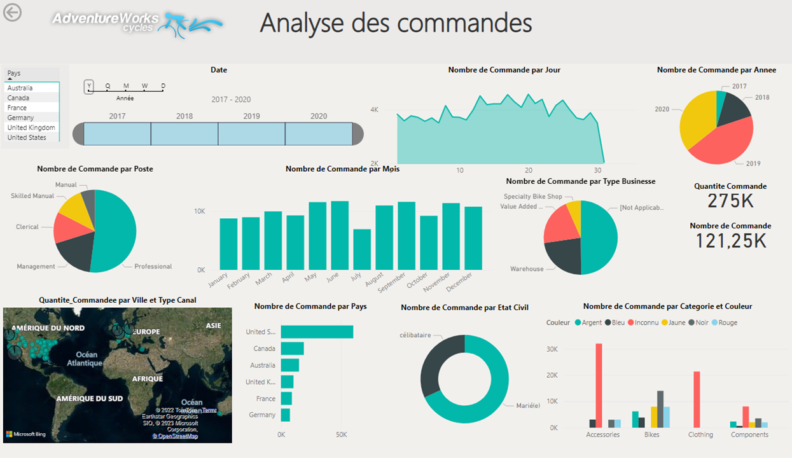

# AdventureWorks Cycle Dataset Analysis

<h1> Analyse et visualisation des données des ventes entre 2017 et 2020</h1>
Ce projet implique l'analyse de l'ensemble de données AdventureWorks Cycle à l'aide de la bibliothèque Python Pandas pour la préparation des données, Talend pour ETL et Power BI pour le tableau de bord.

## 1. Aperçu de l'ensemble de données
Le jeu de données AdventureWorks Cycle est un exemple de jeu de données fourni par Microsoft qui contient des données de vente pour une entreprise fictive qui vend des vélos et des accessoires associés. L'ensemble de données est disponible aux formats CSV et SQL Server et comprend des informations sur les commandes client, les clients, les produits, etc. Dans ce projet, les données sont sous format csv avec plus de 121000 lignes et 45 colonnes. 

## 2. Objectifs du projet
Les objectifs de ce projet sont les suivants :

* Analyser et Préparez les données avec Pandas. Ensuite, découper le jeu de données en quatre source différentes(MySQL, PostgeSQL, CSV, EXCEL) pour effectuer la partie ETL.
* Effectuez ETL (Extract, Transform, Load) sur les données préparées à l'aide de Talend.
* Créez des tableaux de bord et des visualisations dans Power BI pour obtenir des informations et communiquer les résultats.

## 3. Les outils utilisés
* Anaconda Jupyter Notebook: Anaconda est une distribution libre et open source2 des langages de programmation Python et R.
* Pandas : une bibliothèque Python utilisée pour la manipulation et l'analyse de données.
* Talend : un outil ETL open source qui permet l'intégration, la transformation et le nettoyage des données.
* Power BI : un outil de business intelligence utilisé pour créer des tableaux de bord et des visualisations interactifs.
* MySQL: Un système de gestion de bases de données relationnelles.
* PostgreSQL: Un système de gestion de base de données relationnelle orienté objet

## 4. Exécution du projet
Pour exécuter le projet procédez comme suit :

* 1. Ouvrez le fichier Jupyter Notebook analyse_data.ipynb et suivez les instructions pour préparer les données à l'aide de Pandas.
* 2. Ouvrez Talend et importez le projet AWC. La structure de projet est comme suit:

Dans le menu metadonnées, configurer les données d'entrée(Les paths du fichier csv, fichier excel et les connexions avec les bases de données). Exécuter les jobs comme suit <b>JOB_datawarehouse</b>, puis <b>JOB_cubes</b> et la dernière <b>JOB_fait</b>.

### La structuration du projet AWC Talend.
* 1. La première JOB <b>JOB_datawarehouse</b> pour la création du datawarehouse.

* 2. La première JOB <b>JOB_cubes</b> pour créer les dimensions.

* 3. La première JOB <b>JOB_fait</b> pour la table de fait

* 3. Ouvrez Power BI et connectez-vous aux données préparées. Créez des tableaux de bord et des visualisations pour obtenir des informations et communiquer les résultats, dans cette partie nous allons crée trois tableaux de bords, le premier visualise les informations des clients et leurs participation, le deuxième démontre les différentes produits vendus et enfin le troisième qui concerne les commandes efféctuées le long de cette période.

### La structuration du projet Power BI.
* 1. Le modèle utilisé dans ce projet et le modèle en étoile comme montré dans la figure suivante.

* 2. Tableau de bords des données clients

* 3. Tableau de bords des données produits

* 4. Tableau de bords des données commande

## 4. Conclusion
Ce projet démontre l'utilisation de divers outils d'analyse et de visualisation de données. En utilisant Pandas pour la préparation des données, Talend pour ETL et Power BI pour les tableaux de bord, nous pouvons obtenir des informations à partir de grands ensembles de données et communiquer efficacement nos résultats.
